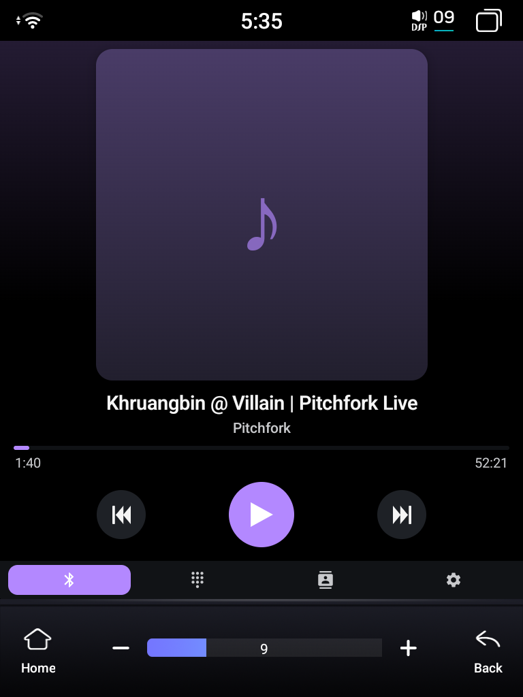
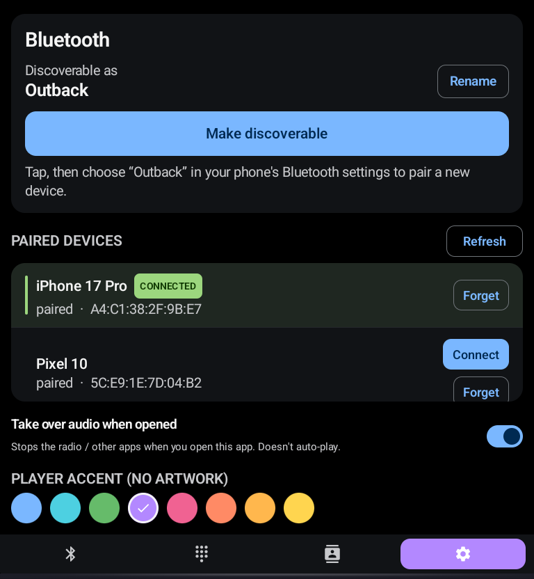
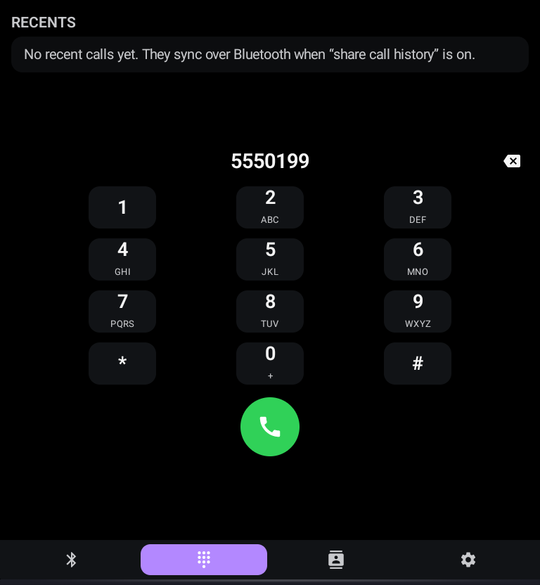
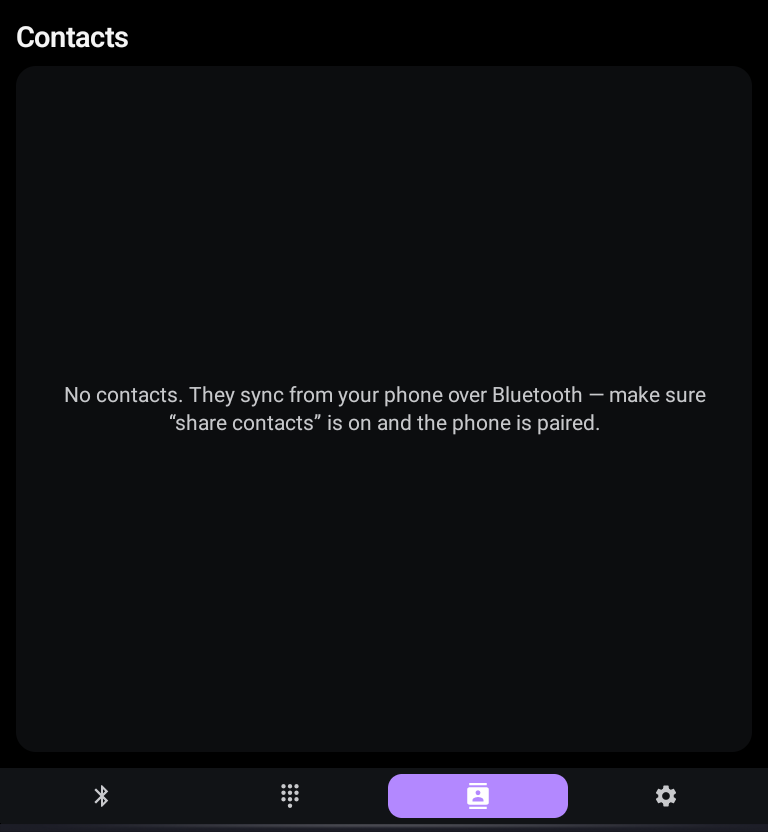

# FYT Bluetooth

A no-root replacement Bluetooth UI for the FYT (Feiyiteng) head unit, targeting the
broken stock `com.syu.bt`. Side-loads as a normal user app; coexists with the SYU stock
apps rather than replacing them.

> **Designed and tested on a 1024×768 vertical "Tesla-style" head-unit screen** (portrait,
> 768 px wide × 1024 px tall). The whole UI assumes that tall, narrow, finger-operated layout.

## Screenshots

<p align="center"></p>

<p align="center">
  
  &nbsp;
  
  &nbsp;
  
</p>

<sub>Now Playing (no-art accent fallback shown), the Bluetooth/pairing pane, the dialer, and contacts.
Device names and addresses are placeholders.</sub>

## Why this exists

I bought this head unit from the **WDFL Car** store on AliExpress, and its **stock Bluetooth app
is broken**: you can't set the device's broadcast name, you can't pair a new phone, and it shows
"nothing connected" even while audio is actually playing. For daily use it's basically unusable.

The catch is that the underlying Android Bluetooth stack is *fine* — only the vendor's UI app is
broken. Poking at it over `adb` (setting the adapter name, triggering discoverable mode, pairing
a phone, reading the call log) all worked. So I built this as a normal **sideloaded, no-root** app
that reimplements the Bluetooth UI — plus a media player and a dialer — to route around the stock
app's bugs. It runs alongside the SYU stock apps; it doesn't (and can't) uninstall them.

**`FINDINGS.md`** is the deep technical writeup — the MCU audio-source model, the reverse-engineered
SYU vendor IPC, the auto-pause mechanism, the "silent audio" saga, and all the dead-ends and niche
testing it took to figure this hardware out. Start there if you want the "why."

See `spec.md` (or the original build spec) for the full set of verified device facts
and constraints. The short version:

- UNISOC UIS7870SC, Android 13 (API 33), AOSP, **non-rooted**, portrait 768×1024.
- The unit is the **A2DP sink** (`A2dpSinkService`). The phone is the source.
- An **MCU** under Android owns audio routing: one active source at a time, identified by an
  integer `APP_ID`. Source switching bypasses Android audio focus, so the only reliable signal is
  the MCU's `APP_ID`, read live over the SYU vendor IPC. See `FINDINGS.md` §1–3.
- Discoverable mode is hard-capped at 300 s by the OS. We do not try to exceed this.
- HFP / SCO / call audio is explicitly **out of scope** (system-only).

## MVP scope (built)

- Runtime permissions: `BLUETOOTH_CONNECT`, `BLUETOOTH_SCAN` (`neverForLocation`),
  `BLUETOOTH_ADVERTISE`.
- "Make discoverable (5 min)" with live countdown.
- Scan / stop scan for nearby devices.
- Paired devices list with **Forget** (reflective `removeBond`, fails gracefully if blocked).
- Pair from the discovered list.
- Adapter state + scan-mode banner.
- Best-effort A2DP-sink connection display via `getProfileProxy` on the hidden profile id `11`.

## Beyond MVP (built since)

- **Now Playing** pane: album art centerpiece, transport controls, track/artist/album, display-only
  playhead, dynamic accent + blurred-art background.
- **Audio that actually plays**: switches the MCU source to Bluetooth so phone audio comes out of
  the speakers (the stock app used to be the only way). See `FINDINGS.md` §5.
- **Automatic source coordination** (the big one): a foreground service reads the MCU's active
  source over the SYU IPC and **pauses the phone (and the unit's own music/Spotify) when you switch
  to the radio or any other source, then resumes when you switch back** — reliably, even with our UI
  off-screen, and without ever overriding a manual pause. See `FINDINGS.md` §1–4.
- **Online album-art fallback** (iTunes Search) + offline disk cache, for phones/apps that don't
  send art over Bluetooth (Spotify, iPhones).
- **Dialer + Contacts + Recents** from the phone over Bluetooth PBAP.

## Project layout

```
app/
  src/main/AndroidManifest.xml
  src/main/kotlin/com/fytbt/
    MainActivity.kt
    bt/BluetoothController.kt   ← all system Bluetooth integration lives here
    bt/Models.kt
    ui/MainScreen.kt
    ui/theme/Theme.kt
  src/main/res/values/{strings.xml,themes.xml}
build.gradle.kts                  ← root
settings.gradle.kts
gradle/libs.versions.toml
```

`BluetoothController` is the only class that touches `BluetoothManager` / `BluetoothAdapter`
or the BroadcastReceivers. It exposes everything as `StateFlow`s; the Compose UI is dumb.

## Build & deploy to the unit

Wireless debugging only — the head unit has no usable USB-data port. The adb port rolls on
every reboot, so reconnect each boot.

```bash
# 1. connect (port changes each reboot)
adb connect 192.168.158.192:<current_port>
adb devices                                    # confirm exactly one device

# 2. build a debug APK
cd ~/FytBt
./gradlew :app:assembleDebug

# 3. install + launch
adb install -r app/build/outputs/apk/debug/app-debug.apk
adb shell monkey -p com.fytbt 1
```

No signing setup needed for debug builds.

## What to verify on first install (MVP acceptance)

1. Launch the app → permission dialog requests CONNECT / SCAN / ADVERTISE.
2. Tap **Make discoverable** → the unit is visible from a nearby phone for ~5 min;
   countdown updates live in the button label.
3. Paired devices show up immediately under "Paired devices".
4. Tap **Scan** → nearby devices appear; tapping **Pair** initiates bonding and the row
   reflects `pairing… → paired`.
5. **Forget** on a paired row succeeds when the reflective `removeBond` is allowed; otherwise
   the row stays paired and no crash occurs (check logcat tag `FytBt` for the reason).

## Known limitations (by design)

- Cannot exceed the 300 s discoverable cap; not solvable from a user app.
- A2DP-sink **connect** is not implemented — bonding alone usually causes the phone (source)
  to reconnect automatically. We display sink connection state when the proxy is bindable.
- AVRCP **seek** is not honored by the source (drag snaps back), so the playhead is display-only.
- HFP call audio/mic is broken in firmware (a call wedges the unit mic until reboot) and is
  system-gated regardless — see `FINDINGS.md` §10. Calls connect but you can't be heard.
- Cannot uninstall / disable the stock SYU apps. This app simply runs alongside them.
